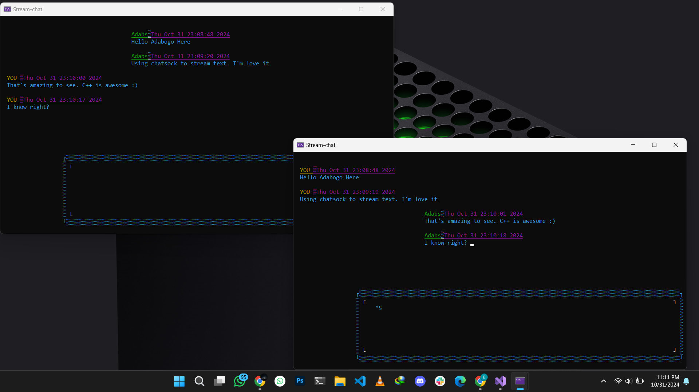

# ChatSock
This project is a simple IRC CLI based chatting system .
#Dependencies
Both client and server uses a library I've writing called Pnet.lib and the ncurses library for text presentation and formatting within the terminal
*This project is still with a lot of flows 


### **Overview**

Stream-Chat is a C++ console application that enables real-time text-based communication between multiple clients. It leverages the Pnet library for network operations and ncurses for a user-friendly text-based interface.


### **Key Features:**
-   **Server-Client Architecture:** The application follows a server-client architecture for efficient communication.
-   **UDP Broadcast:** The server broadcasts its availability using UDP to enable client discovery.
-   **TCP Communication:** Clients establish TCP connections with the server for reliable message exchange.
-   **Non-Blocking I/O:** Asynchronous I/O techniques are used to handle multiple connections efficiently.
-   **Text-Based Interface:** The ncurses library provides a user-friendly text-based interface with features like color coding and input handling.
-   **Message Broadcasting:** The server broadcasts received messages to all connected clients in real-time.


### **Code Structure**
The code is organized into two main components:

**Server:**
-   Initializes network communication.
-   Listens for incoming client connections.
-   Broadcasts server availability.
-   Handles message reception and broadcasting.
  
**Client:**
-   Discovers the server using UDP broadcasts.
-   Connects to the server.
-   Handles user input and sends messages to the server.
-   Receives and displays messages from the server.


### **Technical Implementation**

The codebase primarily relies on:
-   **Pnet Library:** For network operations like socket creation, connection establishment, and data transmission.
-   **ncurses Library:** For creating and managing the text-based user interface.
-   **C++ Standard Library:** For core functionalities like string manipulation, file I/O, and threading.


**Server Code**
```
//C++
// Server Code
#include <Pnet/Pnet.h>
#include <iostream>
#define BROADCAST_PORT 9956
#define PORT 9034

using namespace Pnet;

int main()   
 {
    // ... (server initialization and connection handling)

    // ... (loop to handle client connections and messages)
    while (true) {
        // ... (select() to check for incoming connections and messages)

        if (FD_ISSET(ListeningSocket.GetHandle(), &ReadSet)) {
            // Accept new client connections
            // ...
        }

        for (i = 0; i < SocketArray.GetTotal(); i++) {
            if (FD_ISSET(SocketArray.SocketArray[i].GetHandle(), &ReadSet)) {
                // Receive message from client
                if (SocketArray.SocketArray[i].SWSARecv() == PResult::OK) {
                    // Broadcast message to all connected clients
                    for (DWORD j = 0; j < SocketArray.GetTotal(); j++) {
                        if (j != i) {
                            SocketArray.SocketArray[j].SetBuffer(SocketArray.SocketArray[i].GetSocketData());
                            SocketArray.SocketArray[j].SWSASend(SocketArray.SocketArray[j].GetSocketData());
                        }
                    }
                }
            }
        }
    }
}
```

### Server Console View
The server console logs below demonstrate how messages are routed and broadcast to all connected clients. This provides insight into server activity and client connection management.


**Client Code**

C++
```
// Client Code
// ... (client initialization and server discovery)

while (true) {
    // ... (select() to check for incoming messages and user input)

    if (FD_ISSET(socket.GetHandle(), &ReadSet)) {
        // Receive message from server
        if (socket.SWSARecv() == OK) {
            // Display received message in the chat window
            display_recv(MAIN, socket.GetSenderName(), socket.GetSocketData());
        }
    }

    if (FD_ISSET(socket.GetHandle(), &WriteSet)) {
        // Send message to server
        if (inputStr.size() > 0) {
            socket.SWSASend(inputStr);
            // Display sent message in the chat window
            display(MAIN, inputStr, 10);
        }
    }
}

```

***Client interface***
# Console View Example

The image below shows the real-time interaction between clients in the console, where messages are displayed as they are sent and received.




**Building the Application**
To build the application, you'll need a C++ compiler (like GCC or Clang) and the Pnet and ncurses libraries. You can compile the code using a command like:

```
Bash
g++ -o stream_chat server.cpp client.cpp -lpnet -lncurses

/*This will create two executable files: server and client.*/
```


**Future Improvements**

-   **Security:** Implement encryption and authentication mechanisms to protect data privacy and integrity.
-   **Error Handling:** Enhance error handling to provide informative messages and handle unexpected situations gracefully.
-   **User Interface:** Consider a graphical user interface for a more user-friendly experience.
-   **File Transfer:** Enable file sharing between clients.
-   **Group Chat:** Support group chats with multiple participants.
-   **Asynchronous Programming:** Utilize asynchronous programming techniques for performance and scalability improvements.
